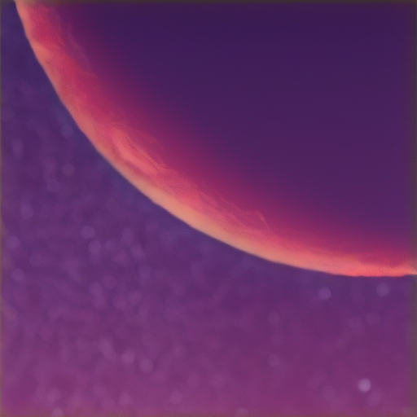
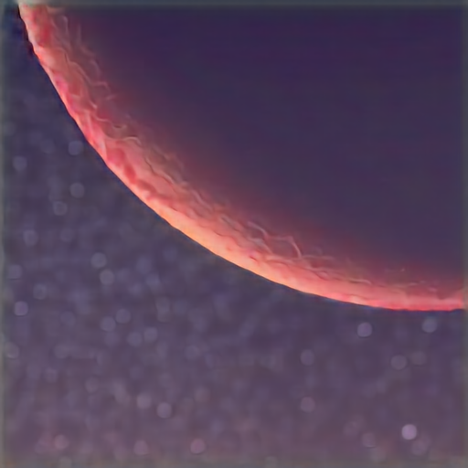

# VAElight

Fast, small (1MB size) and bad-quality VAE encoder-decoder for streaming.

based on https://huggingface.co/graphnull/vae_onnx

original_______________________| encoder______________________| decoder_____________________

    

     

## Example use encoder in python (in progress)
```python
import onnxruntime
providers = ['CUDAExecutionProvider','CPUExecutionProvider']

vae_encoder = ort.InferenceSession('./VAEencoder.onnx', providers=providers)
img = Image.open('./examples/example1.jpg' )
img.load()
data = np.asarray( img, dtype="uint8")
normalized = (np.expand_dims(data.transpose((2,0,1)).astype(np.single), axis=0)/ 255.0) * 2.0 - 1.0
latent = vae_encoder.run(None, {"input": normalized })[0]

#need import vae_decoder
decoded_image = vae_decoder.run(None, {"latent":latent})[0]
decoded_image = decoded_image[0].transpose(1,2,0).clip(-1,1)

display(Image.fromarray(( decoded_image*127+127).astype(np.uint8)))
```


## Example use decoder in python (in progress)
```python
import onnxruntime
import cv2

img = Image.open('./example.jpg' ).load()
data = np.asarray( img, dtype="uint8")

# from https://huggingface.co/graphnull/vae_onnx/
vae_encoder = ort.InferenceSession('../vae_encoder.onnx', providers=providers)

normalized = (np.expand_dims(data.transpose((2,0,1)).astype(np.single), axis=0)[:,:,:512,:512]/ 255.0) * 2.0 - 1.0
latent = vae_encoder.run(None, {"input": normalized })[0]

providers = ['CUDAExecutionProvider','CPUExecutionProvider']
vae_decoder = ort.InferenceSession('./VAEpreview.onnx', providers=providers)

base, freq2x, freq4x, freq8x = vae_decoder.run(None, {"latent":latent})

base = cv2.resize(base[0].transpose(1,2,0), dsize=(512, 512), interpolation=cv2.INTER_LINEAR )
freq2x = cv2.resize(freq2x[0].transpose(1,2,0), dsize=(512, 512), interpolation=cv2.INTER_LINEAR )
freq4x = cv2.resize(freq4x[0].transpose(1,2,0), dsize=(512, 512), interpolation=cv2.INTER_LINEAR )
freq8x = cv2.resize(freq8x[0].transpose(1,2,0), dsize=(512, 512), interpolation=cv2.INTER_LINEAR )

display(Image.fromarray(( (base+freq2x+freq4x+freq8x)*127+127).astype(np.uint8)))
```
